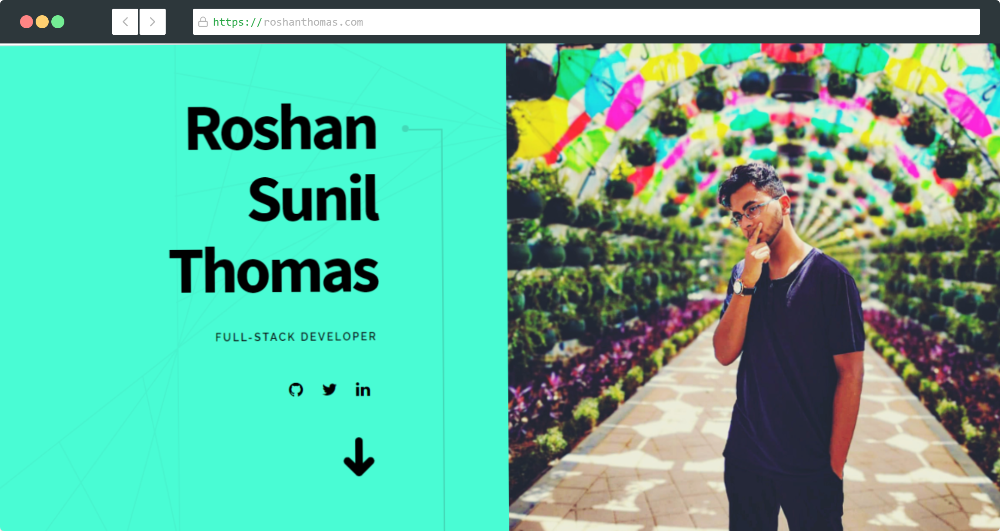

# Roshan Thomas - Portfolio

## Screenshot



Check out my portfolio [here](https://roshanthomas.netlify.app/)

<br>
<br>

## Install

Make sure that you have the Gatsby CLI program installed:

```sh
npm install --global gatsby-cli
```

And run from your CLI:

```sh
gatsby new <site-name> https://github.com/Roshan-Thomas/Portfolio-RoshanThomas
```

Then you can run it by:

```sh
cd gatsby-example-site
npm install
gatsby develop
```


## Contribution

Suggestions and PRs are welcome!

Please create issue or open PR request for contribution.

